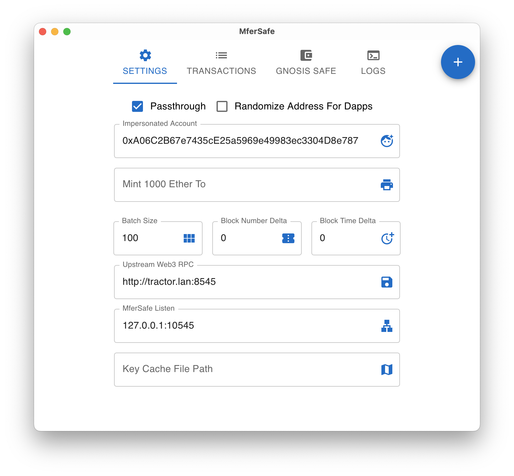
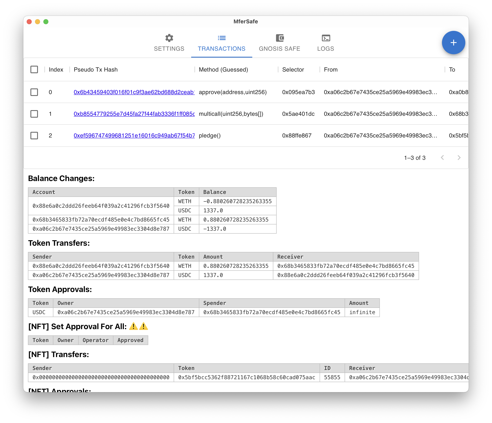
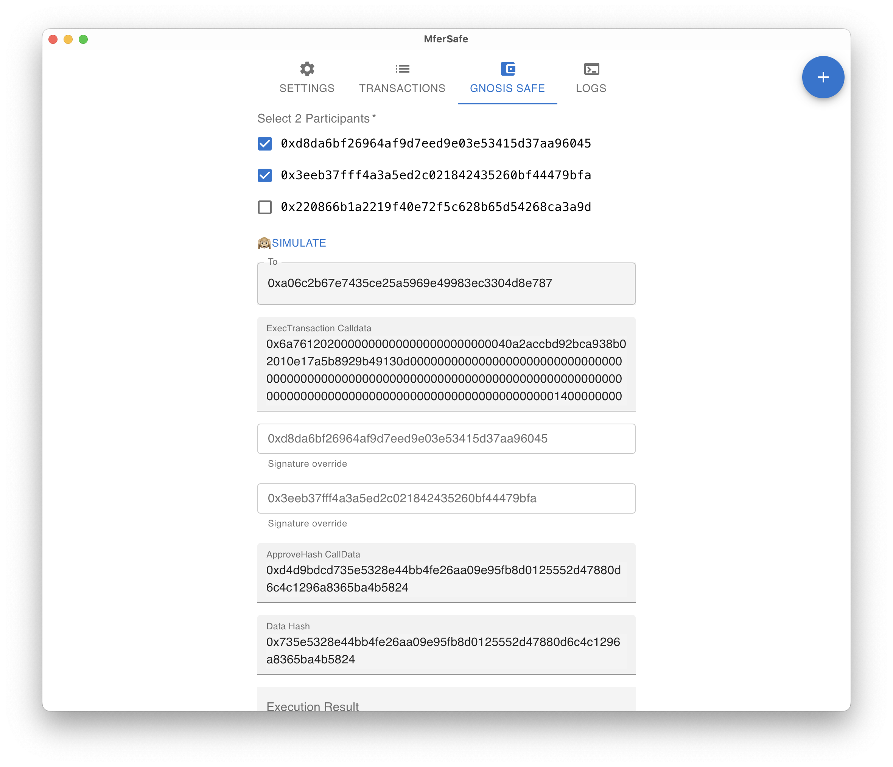
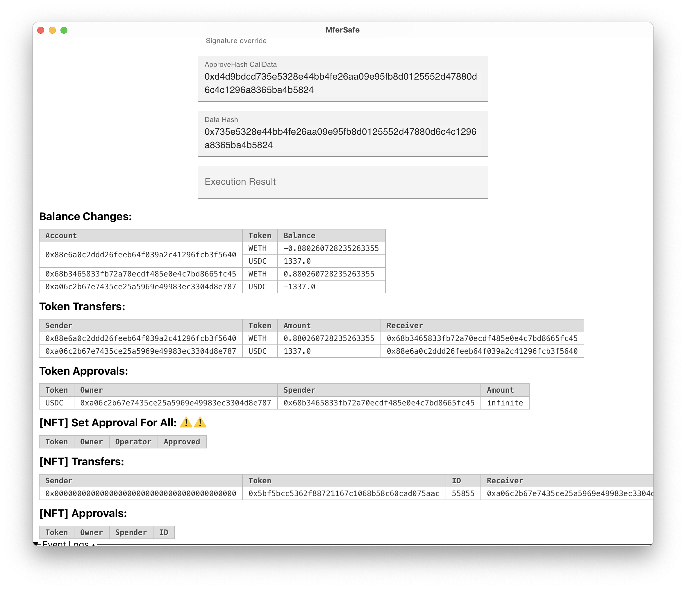
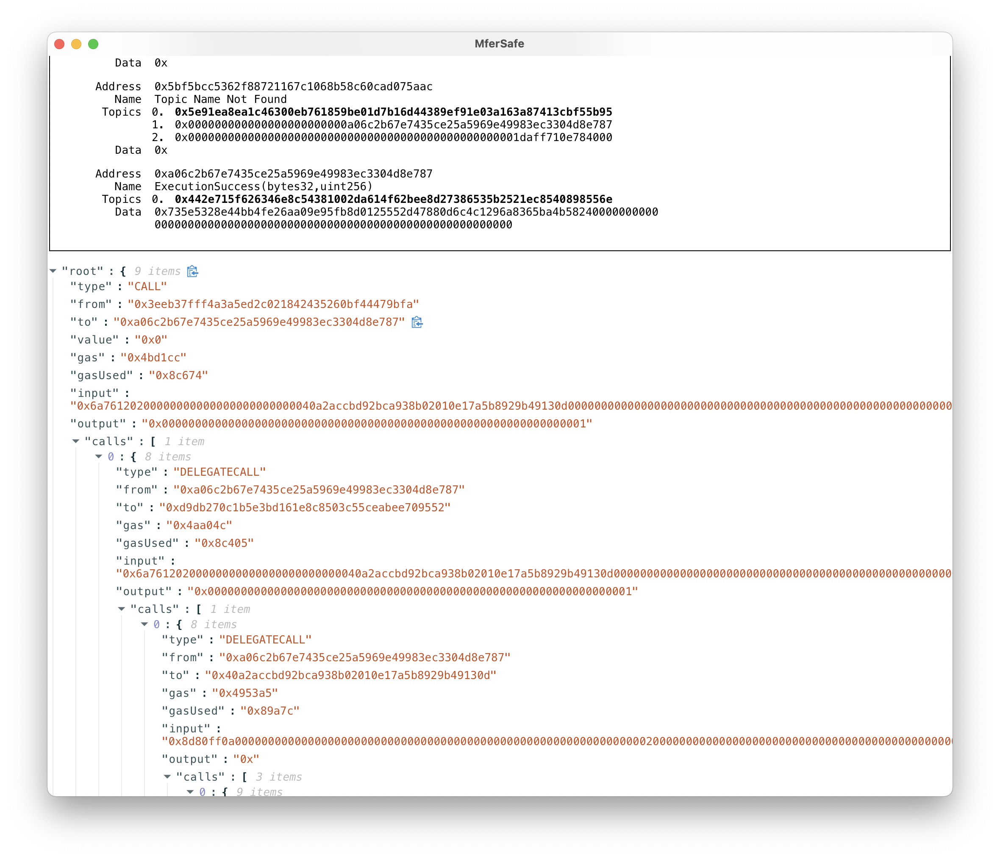

## MferSafe is inspired by [ApeSafe](https://github.com/banteg/ape-safe), which focuses on interaction via Dapp's front end.

What can MferSafe do?

Let me show some cases:

For users who want to experience dapps for free.

For advanced users who want to inspect dapp details.

For developers who want to test in production.

For MEV searchers (pinning blocks, arbitrage by hand, then analyzing call traces to evaluate profit).

For whitehats (test attack vector in almost real-world, mint huge amount of money for oracle manipulation).

For Gnosis Safe MultiSig Wallet users or other smart wallet users.

Protect your assets from a compromised front end.

Protect your privacy by using Address Randomization.

More functions will be extended by you! (just write some simple HTTP requests)

By using MferSafe's browser extension, it will redirect all eth_xx RPC to MferSafe and record all transactions, and make state mutations at local, so you can do lots of Dapp interactions seamlessly.

You can set the account address (ENS is supported) you want to impersonate and view the local transaction pool, inspect each transaction's event log and debug trace.

If you are using the GnosisSafe multi-sig wallet, you can simulate the local transaction pool as a transaction bundle, and send the bundle via MultiSend.

MferSafe also provides a convenient way to sign GnosisSafe transactions. When you simulate the transaction bundle, it shows up ApproveHash and ApproveHashCalldata.

You have 2 options to execute the multi-sig transaction.

The widely used way is to sign the ApproveHash and set each participant's Signature Override field, then you can send a transaction to your wallet address and set the calldata to 'ExecTransaction Calldata'.

The other way of signing the transaction is by calling 'approveHash' function by all participants and sending the execution transaction by the last participant.

Demo:

### How to use

1. [Install browser-extension](https://chrome.google.com/webstore/detail/mfersafe/ppkcjeilamojjbimmkbpkfknjccpflbh)
2. Launch the MferSafe app

### Screenshots

 ### Build

Apple Silicon macOS Prerequisite:

`brew install pkg-config cairo pango libpng jpeg giflib librsvg pixman`

1. [Install tauri build environment](https://tauri.app/zh/v1/guides/getting-started/prerequisites)
2. [Install golang](https://go.dev/doc/install)
3. `./build.sh`

### Download Binary build by Github Action

[Download Binary] https://github.com/sec-bit/mfer-safe/releases
