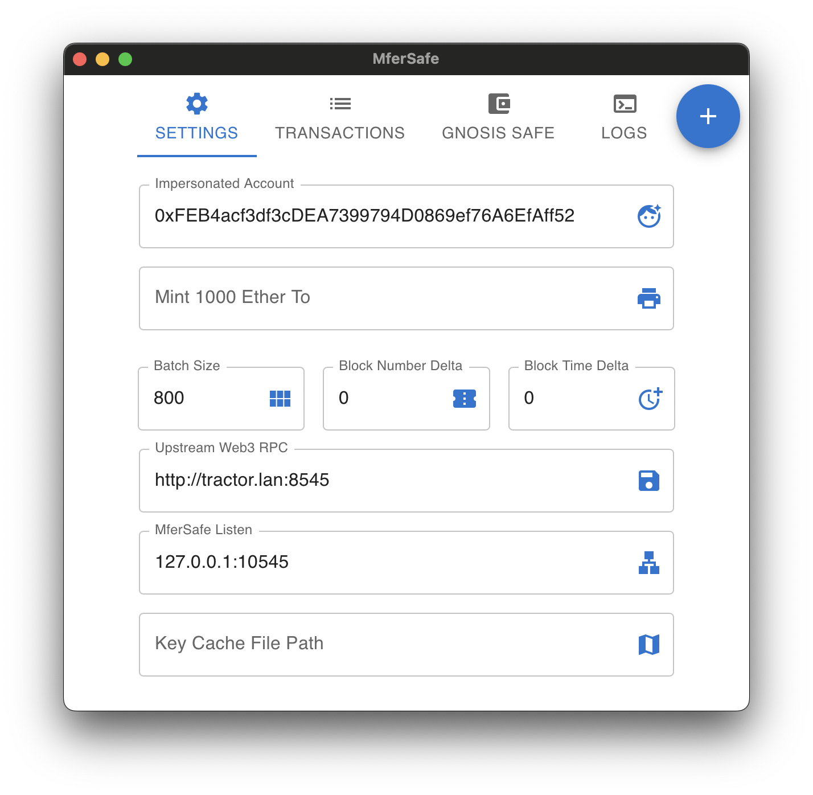
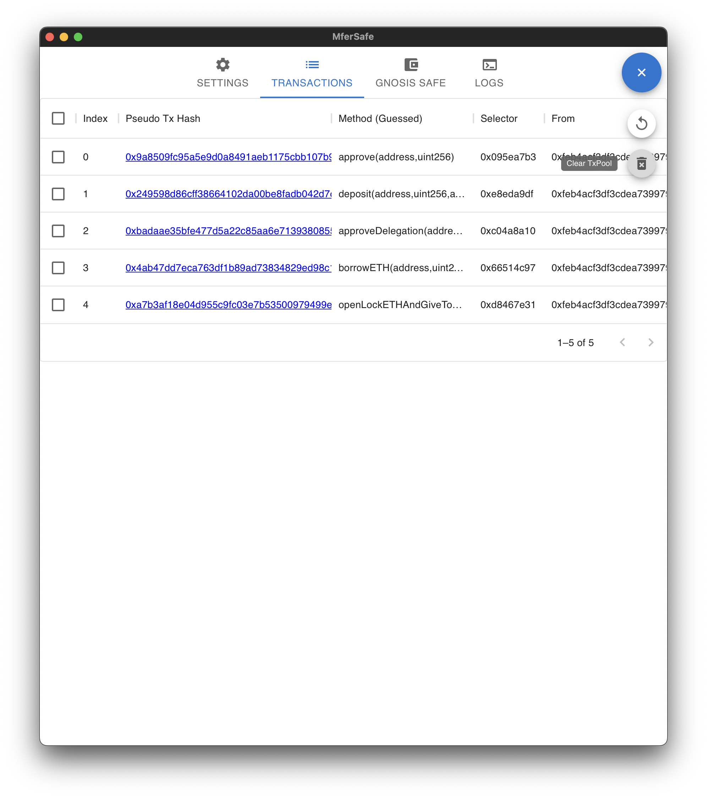
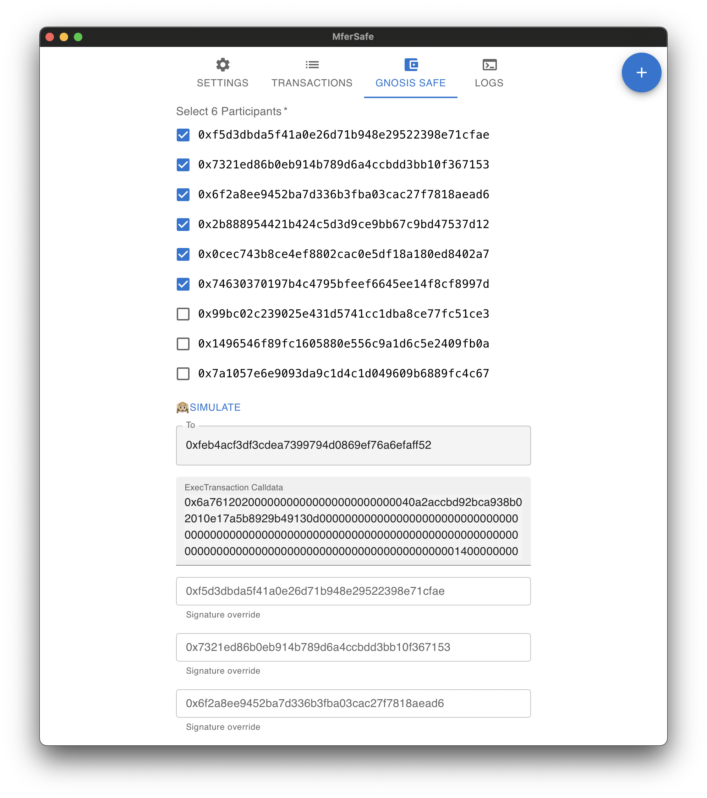
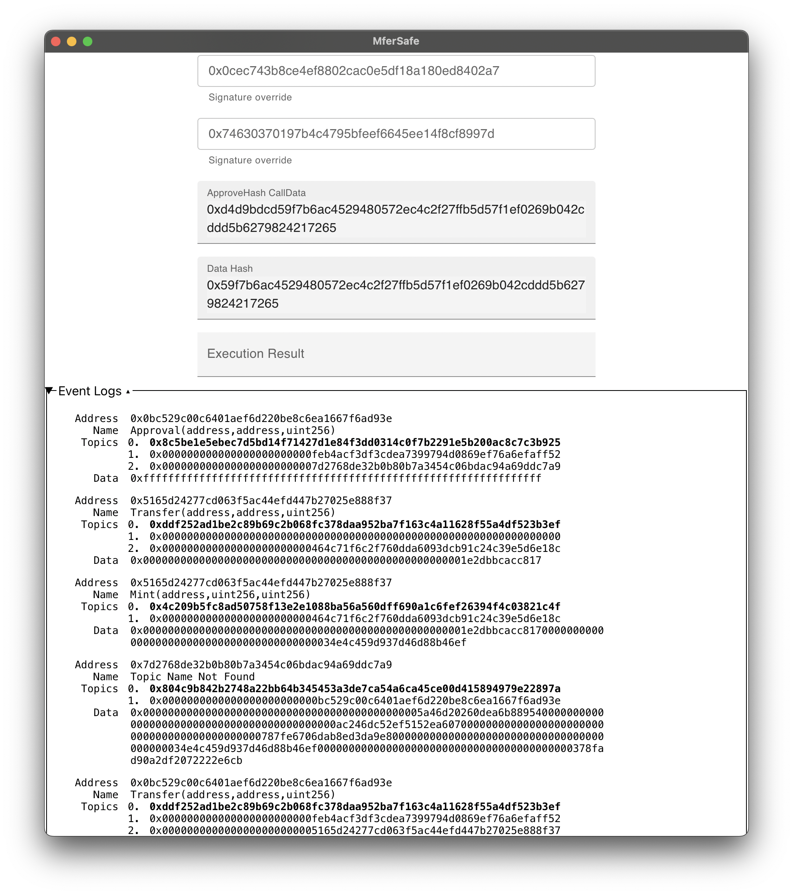
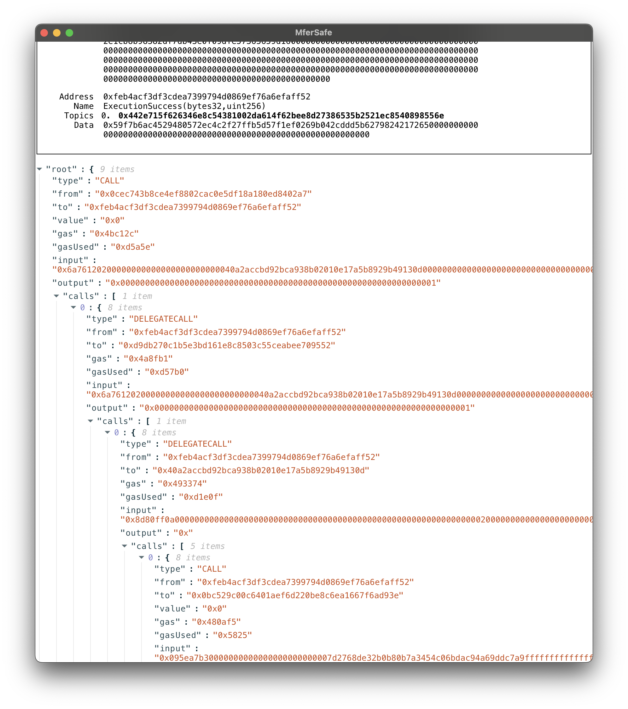

## MferSafe is inspired by [ApeSafe](https://github.com/banteg/ape-safe), which focuses on interact via Dapp's frontend.

By using MferSafe's browser extension, it will redirect all eth_xx rpc to MferSafe and record all transactions and make state mutation at local, so you can do lots of Dapp interactions seamlessly.

You can set the account address (ENS is supported) you want to impersonate and view the local transaction pool, inspect each transaction's event log and debug trace.

If you are using GnosisSafe multisig wallet, you can simulate the local transaction pool as a transaction bundle, and send the bundle via MultiSend.

MferSafe also provides a convenient way to sign GnosisSafe transaction. When you simulate the transaction bundle, it shows up ApproveHash and ApproveHashCalldata.

You have 2 options to execute the multisig transaction.

The widely used way is to sign the ApproveHash and set each participant's Signature Override field, then you can send a transaction to your wallet address and set the calldata to 'ExecTransaction Calldata'.

The other way of signing the transaction is calling 'approveHash' function by all participants and send execution transaction by the last participant.

Demo:

### How to use

1. [Install browser-extension](https://chrome.google.com/webstore/detail/mfersafe/ppkcjeilamojjbimmkbpkfknjccpflbh)
2. Launch MferSafe app

### Screenshots

 ### Build

Apple Silicon macOS Prerequisite:

`brew install pkg-config cairo pango libpng jpeg giflib librsvg pixman`

1. [Install tauri build environment](https://tauri.app/zh/v1/guides/getting-started/prerequisites)
2. [Install golang](https://go.dev/doc/install)
3. `./build.sh`

### Download Binary build by Github Action

[Download Binary] https://github.com/sec-bit/mfer-safe/releases
